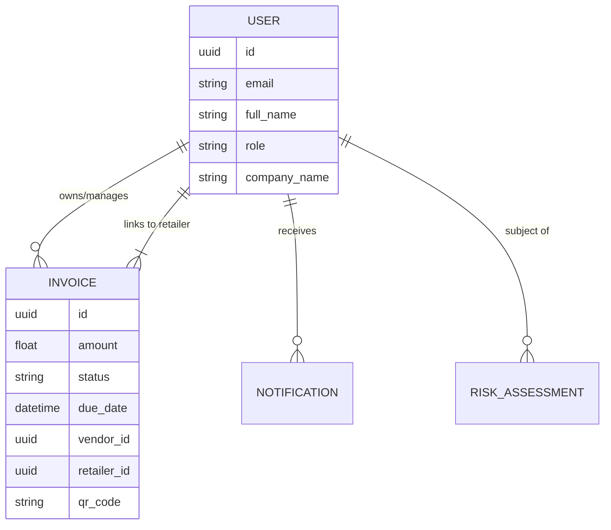

# KaziFlow Backend: Technical Architecture & Core Logic

This document explains the technical "tactics" used to build the KaziFlow supply chain finance backend.

## 1. Core Technology Stack
- **Framework**: [FastAPI](https://fastapi.tiangolo.com/) - Chosen for its high performance, automatic OpenAPI documentation, and native support for asynchronous programming.
- **Database Wrapper**: [SQLModel](https://sqlmodel.tiangolo.com/) - A library that combines SQLAlchemy (for database interactions) and Pydantic (for data validation). This allows using the same models for both database tables and API responses.
- **Database**: **SQLite** (local file `database.db`) - Used for the prototype phase as it requires zero configuration and provides a portable, relational storage solution.
- **AI Engine**: **Google Gemini 2.0 Flash** - Integrated via the `google-generativeai` package to provide real-time risk analysis.

## 2. Authentication Strategy
KaziFlow leverages **JWT (JSON Web Tokens)** for stateless authentication.
- **Password Hashing**: Uses `bcrypt` for secure storage.
- **The Python 3.13 Fix**: Since `passlib` is deprecated and has compatibility issues with Python 3.13 (specifically `bcrypt` 4.x), we implemented a **Robust Monkeypatch** in `backend/main.py`. This ensures the backend remains stable and secure regardless of the underlying library version.
- **Role-Based Access Control (RBAC)**: Every token contains the user's role (`vendor`, `retailer`, `bank`, `admin`). Endpoints use the `get_current_user` dependency to verify permissions before processing requests.

## 3. Database Architecture
The database follows a relational structure optimized for supply chain tracking:

## 4. Key Innovation: QR-Based Verification
To bridge the gap between physical delivery and digital financing:
- **Tactic**: Upon invoice creation, the backend generates a unique QR code.
- **Implementation**: The QR code is converted to a **Base64 string** (Data URI). This allows the frontend to display the QR code directly as an image without needing a separate file storage service (like AWS S3) for the prototype.
- **Verification**: Retailers can scan (or manually enters the ID) to confirm they have received the goods, which immediately updates the invoice status to `verified`.

## 5. AI Risk Scoring (FIFO Logic)
Our AI model evaluates "FIFO Back Score" by analyzing:
- **Consistency**: How often does the vendor deliver on time?
- **Relationship Health**: How long have the vendor and retailer worked together?
- **Transaction Density**: Are there frequent, healthy transactions (First-In, First-Out)?

The AI prompt (in `backend/services/ai_service.py`) instructs Gemini to return a structured JSON response including a score (0-100) and specific risk factors.
